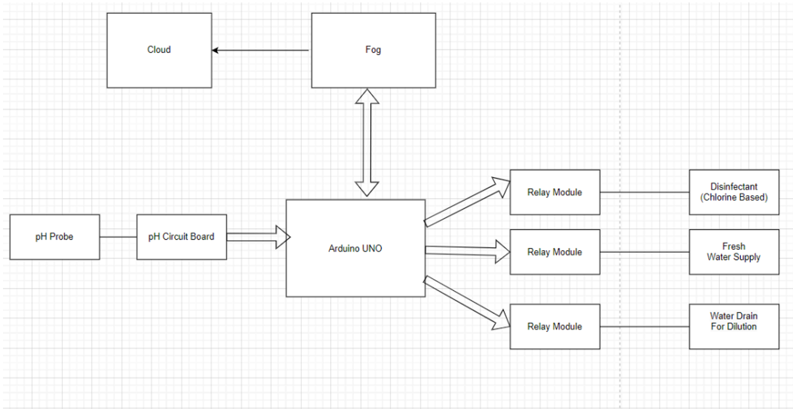
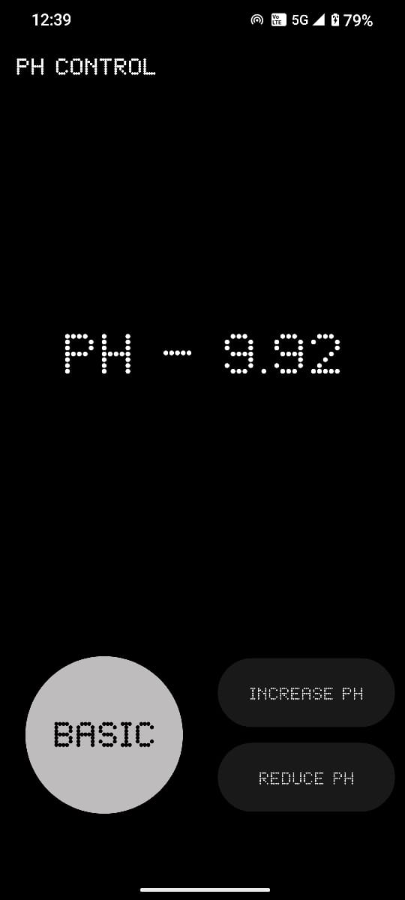
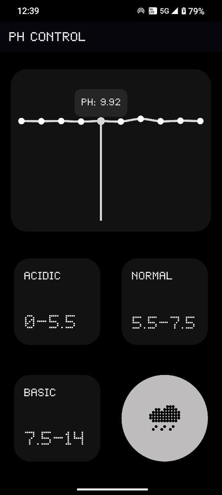

# 🏊‍♂️ Smart Swimming Pool pH Monitoring & Maintenance System  

This project is a **Smart pH Monitoring and Maintenance System** for swimming pools, designed to automatically regulate and monitor pool water pH levels.  
It integrates **Arduino hardware**, a **Python server (socket programming)**, and a **Flutter mobile application** for pool owners.  

---

## 📌 Project Overview  

Maintaining the correct **pH level in swimming pools** is essential for water quality, swimmer safety, and pool equipment longevity.  

This system:  
- Continuously monitors pool water **pH levels** using a **pH sensor** connected to an **Arduino Uno**.  
- Automatically pumps **acidic, basic, or normal water** using motors and valves to balance the pH level.  
- Sends real-time **pH readings** to a **Python socket server**.  
- Allows pool owners to **view insights & analysis** of their pool’s pH levels via a **Flutter mobile app**.  

---

## ⚙️ System Architecture  

The project integrates hardware and software components as shown below:  

  

**Components:**  
- **Arduino Uno** – Reads values from pH sensor, controls pump motors.  
- **Motors & Valves** – Dispense acidic/basic/neutral solutions.  
- **Python Server (Socket Programming)** – Receives sensor data, processes it, and relays to the mobile app.  
- **Flutter Mobile App** – Displays pH readings, trends, and recommendations for the pool owner.  

---

## 📱 Mobile Application  

The **Flutter app** provides real-time monitoring and analysis:  

- 📊 pH level visualization over time  
- 🔔 Notifications if pH is outside the safe range  
- 📈 Trends & analytics for pool water condition  

### Screenshots  
| Home Screen | Analytics Screen |  
|-------------|------------------|  
|  |  |  

---

## 🛠️ Tech Stack  

- **Hardware:** Arduino Uno, pH Sensor, Motors, Valves  
- **Backend Server:** Python (Socket Programming)  
- **Mobile App:** Flutter (Dart)  
- **Database/Cloud Services:** Firebase  

---

## 🚀 Setup & Installation  

### 1️⃣ Arduino (Hardware Setup)  
- Connect **pH sensor** to Arduino Uno.  
- Connect **motor drivers & valves** to Arduino pins.  
- Upload the Arduino sketch (code provided in `/arduino_code/`).  

### 2️⃣ Python Server  
- run the command
  ```
  python server.py

---

## 📥 Clone this Repository  

To get started, clone the repository to your local machine:  

```bash
git clone https://github.com/123thirumal/PH-Monitor.git
cd PH-Monitor

